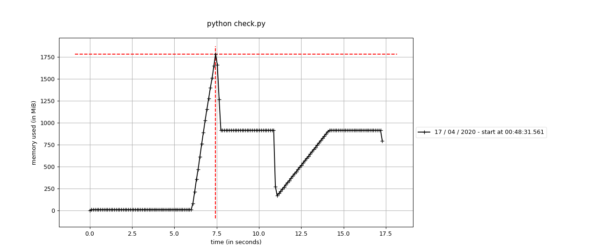
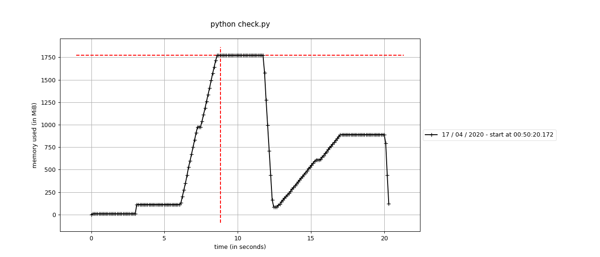

### Checking memory usage from pyo3

For this test I compiled the supplied library using:
`maturin develop --release --strip`

I then executed `check.py` using `memory-profiler` from pip as `mprof run python check.py` with python 3.6.9. This porduced the following graphs:

Here is a vector of 100,000,000 bools created using rust via pyo3, and created in pure python.
The first plateau is rust without any vector of bools for 3 seconds, then rust makes the vector and waits 3 seconds. Then the vector is exported to python which also waits for 3 seconds. After this the list is deleted and then python makes its own list and waits 3 seconds. While the stead state of each list has the same size, the peak for the pyo3 version is much larger.

For objects more complicated: Consider a list of tuples of (list of list, float).
Notice here that the rust-produced type never decreases in size to match the pure python type.

